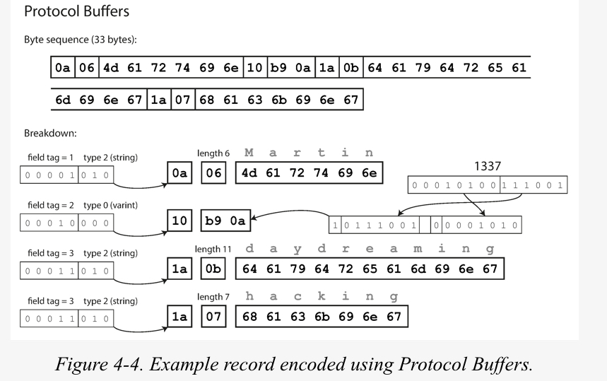

## 4장 부호화와 발전
- 순회식 업그레이드(rolling upgrade, 단계적 롤아웃 staged rollout) : 서버측 어플리케이션에서 한번에 몇개 의 노드에 새 버전을 배포하고 새로운 버전이 원할하게 실행되는지 확인한 다음 서서히 모든 노드에 실행되게 하는 방식
- 호환성:
  - 하위 호환성 : 새로운 코드는 예전 코드가 기록된 데이터를 읽을 수 있어야 한다.
  - 상위 호환성 : 예전 코드는 새로운 코드가 기록한 데이터를 읽을 수 있어야 한다.

- 주요 키워드 : JSON, XML, Protocol Buffer, Thrift, Avro, REST, RPC, Message Queue

### 데이터 부호화 형식
- 부호화(encoding), 직렬화(serialization), 마샬링(marshaling)
- 복호화(decoding), 역직렬화(deserialization), 언마샬링(unmarshaling)

#### 언어별 코드
- JAVA:
  - 참고 : [직렬화(Serialization)란 무엇일까?](https://devlog-wjdrbs96.tistory.com/268), [Serializable Javadoc](https://docs.oracle.com/javase/7/docs/api/java/io/Serializable.html)

  - 정의
  ```java
  private void writeObject(java.io.ObjectOutputStream out)
   throws IOException
  private void readObject(java.io.ObjectInputStream in)
   throws IOException, ClassNotFoundException;
  private void readObjectNoData()
   throws ObjectStreamException;
  ```

  - 사용법
    - 읽기
      ```java
      FileInputStream fis = new FileInputStream(fullPath);
      ObjectInputStream ois = new ObjectInputStream(fis);
      Object obj = ois.readObject();
      SerialDTO dto = (SerialDTO)obj;
      ```
    - 쓰기
      ```java
      SerialDTO dto;
      FileOutputStream fos = new FileOutputStream(filePath);
      ObjectOutputStream oos = new ObjectOutputStream(fos);
      oos.writeObject(dto);
      ```

- python
  - 찾아보니 python에는 marshal, pickle 라이브러리 둘다 있는데 일반적으로 pickle 이 더 선호된다고 합니다.
  - 참고 : [python docs-pickle](https://docs.python.org/ko/3/library/pickle.html)
  - 사용법
    - 읽기 :
      ```python
      with open('list.txt', 'wb') as f:
         pickle.dump(list, f)
      ```
    - 쓰기 :
      ```python
      with open('list.txt', 'rb') as f:
         data = pickle.load(f)
      ```

- go
  - [go.dev - gob](https://pkg.go.dev/encoding/gob)
  - 사용법:
    - 읽기
      ```go
      var buf bytes.Buffer
      dec := gob.NewDecoder(&network)
      var obj Obj
      err = dec.Decode(&obj)
      if err != nil {
        log.Fatal("decode error:", err)
      }
      ```
    - 쓰기
      ```go
      var buf bytes.Buffer
      enc := gob.NewEncoder(&buf)
      err := enc.Encode(obj)
      if err != nil {
        log.Fatal("encode error:", err)
      }
      ```

#### 프로그래밍 언어에 내장된 부호화 라이브러리의 장단점
- 장점 : 편리함
- 단점 :
  - 언어에 종속적이다.
  - 보안에 취약하다. (일반적인 모든 부호화의 문제점)
  - 데이터 버전관리에 문제가 있다.(데이터 버전간 호환성이 떨어진다.)
  - 효율성(자바의 직렬화는 안좋기로 소문이 나있다.)

### JSON과 XML, 이진 변형
- JSON:
  - 출처 : [JSON wikipedia](https://ko.wikipedia.org/wiki/JSON)
```json
{
  "이름": "홍길동",
  "나이": 25,
  "성별": "여",
  "주소": "서울특별시 양천구 목동",
  "특기": ["농구", "도술"],
  "가족관계": {"#": 2, "아버지": "홍판서", "어머니": "춘섬"},
  "회사": "경기 수원시 팔달구 우만동"
}
```

- XML
```xml
<?xml version="1.0"?>
<CAT>
  <NAME>Izzy</NAME>
  <BREED>Siamese</BREED>
  <AGE>6</AGE>
  <ALTERED>yes</ALTERED>
  <DECLAWED>no</DECLAWED>
  <LICENSE>Izz138bod</LICENSE>
  <OWNER>Colin Wilcox</OWNER>
</CAT>
```

- YAML
```yaml
men: [John Smith, Bill Jones]
women:
 - Mary Smith
 - Susan Williams
```

- 언어별 예시(json)
  - java
    출처: [어제 오늘 내일 블로그](https://hianna.tistory.com/631)
    ```java
    import java.util.Map;
    import com.fasterxml.jackson.core.JsonProcessingException;
    import com.fasterxml.jackson.core.type.TypeReference;
    import com.fasterxml.jackson.databind.JsonMappingException;
    import com.fasterxml.jackson.databind.ObjectMapper;
    public class JsonStringToMap {
      public static void main(String[] args) throws JsonMappingException, JsonProcessingException {
        // {"id" : 1, "name" : "Anna"}
        String jsonStr = "{\"id\" : 1, \"name\" : \"Anna\"}";
        // jackson objectmapper 객체 생성
        ObjectMapper objectMapper = new ObjectMapper();
        // JSON String -> Map
        Map<String, Object> jsonMap
        = objectMapper.readValue(jsonStr, new TypeReference<Map<String, Object>>() {});
        // Student 객체 출력
        System.out.println(jsonMap); // {id=1, name=Anna}
      }
    }
    ```

  - python
    출처 : [python doc-json](https://docs.python.org/ko/3/library/json.html)
    ```python
    import json
    json.dumps(['foo', {'bar': ('baz', None, 1.0, 2)}])
    # '["foo", {"bar": ["baz", null, 1.0, 2]}]'
    json.loads('["foo", {"bar":["baz", null, 1.0, 2]}]')
    # ['foo', {'bar': ['baz', None, 1.0, 2]}]
    ```

  - go
    - 출처 : [go-dev](https://pkg.go.dev/encoding/json@go1.18)
    ```go
    func main() {
      type ColorGroup struct {
        ID     int
        Name   string
        Colors []string
      }
      group := ColorGroup{
        ID:     1,
        Name:   "Reds",
        Colors: []string{"Crimson", "Red", "Ruby", "Maroon"},
      }
      b, err := json.Marshal(group)
      if err != nil {
        fmt.Println("error:", err)
      }
      os.Stdout.Write(b)
    }
    ```

    ```go
    type Size int

    const (
      Unrecognized Size = iota
      Small
      Large
    )

    func (s *Size) UnmarshalText(text []byte) error {
      switch strings.ToLower(string(text)) {
      default:
        *s = Unrecognized
      case "small":
        *s = Small
      case "large":
        *s = Large
      }
      return nil
    }

    func (s Size) MarshalText() ([]byte, error) {
      var name string
      switch s {
      default:
        name = "unrecognized"
      case Small:
        name = "small"
      case Large:
        name = "large"
      }
      return []byte(name), nil
    }

    func main() {
      blob := `["small","regular","large","unrecognized","small","normal","small","large"]`
      var inventory []Size
      if err := json.Unmarshal([]byte(blob), &inventory); err != nil {
        log.Fatal(err)
      }

      counts := make(map[Size]int)
      for _, size := range inventory {
        counts[size] += 1
      }

      fmt.Printf("Inventory Counts:\n* Small:        %d\n* Large:        %d\n* Unrecognized: %d\n",
        counts[Small], counts[Large], counts[Unrecognized])

    }
    ```

- 잠시 휴식
---


- 이진 변형
  - 메시지팩, 스리프트와 프로토콜 버퍼, 아브로
  - 

  - 스키마 발전(Schema evolution):
    - 각 필드에 고유한 태그 번호를 부여하여 호환성을 유지한다.

- 스키마 발전 규칙
  - union

#### 그러면 쓰기 스키마는 무엇인가?
- 스키마 버전을 사용하는 데이터베이스 어떤 경우라도 유용하다.

#### 동적 생성 스키마
- 스리프트나 프로토콜 버퍼에서는 데이터베이스 스키마가 변경될 때마다 관리자는 데이터베이스 칼럼 이름과 필드 태그의 매핑을 수동으로 갱신해야 한다.

#### 코드 생성과 동적 타입 언어
- 참고 : [Data Model](https://woong-jae.com/db/210928-datamodel-schema-instance)
- Data Model
  - Conceptual data models(High-level, semantic):
    - 데이터를 현실 세계와 가깝게 인식할 수 있게 해주는 추상적 개념(entity, attribute, relationship 등)을 제공한다.
  - Physical data models(Low-level, internal):
    - 데이터가 실제로 컴퓨터의 저장매체(HDD, RAM, SDD 등)에 어떻게 저장되는지에 대한 개념을 제공한다.
  - Implementation data models(Logical):
    - 위에 나온 양극단 데이터 모델의 중간 개념을 제공한다. 개념 데이터 모델을 상세화하여 논리적인 데이터 집합, 관리 항목, 관계를 정의한 모델이다.
  - Self-describing models:
    - 데이터에 대한 설명과 실제 데이터 값을 합쳐놓은 모델이다. MongoDB와 같은 noSQL 시스템에서 볼 수 있다.

- 잠시 휴식
---
#### 스키마의 장점
- 이진 부호화의 장점:
  - 부호화된 데이터에서 필드 이름을 생략할 수 있기 때문에 다양한 "이진 JSON" 변형보다 크기가 훨씬 작을 수 있다.
  - 스키마는 유용한 문서화 형식이며, 복호화를 할때 스키마가 필요하기 때문에 스키마가 최신 상태인지 확인할 수 있다.
  - 스키마 데이터베이스를 유지하면 스키마 변경이 적용되기 전에 상위 호환성과 하위 호환성을 확인할 수 있다.
  - 정적 타입 프로그래밍 언어 사용자에게 스키마로부터 코드를 생성하는 기능은 유용하다. 컴파일 시점에 타입 체크를 할 수 있기 때문이다.

#### 이야기 거리
- [line 의 Antman 프로젝트 개발기](https://engineering.linecorp.com/ko/blog/antman-project-development-story/)
  - storage layering
  - HEIF : High Efficiency Image File Format
  - 개인 의견 : 부호화가 유의미한 차이를 보인다.

### 데이터플로 모드
- 프로세스 간 데이터를 전달하는 방법: 데이터베이스, 외부 서비스, 비동기 메시지 전달

#### 데이터베이스를 통한 데이터플로
- 생각보다 흔히 볼 수 있는 형태.
- 생각하는 장점 : 직관적이고 단순하다.
- 생각하는 단점 : 여러 서비스가 같은 데이터베이스를 사용하게 되면서 강결합이 되어 추후 문제가 생길 수도 있다.

#### 다양한 시점에 기록된 다양한 값
- 데이터가 코드보다 더 오래 산다(data outlives code)

- 잠시 휴식
---

#### 보관 저장소
#### 서비스를 통한 데이터 플로: REST와 RPC
- 마이크로서비스:
  - 일반적으로 알아야하는 자료 : [Microsoft Docs 클라우드 디자인 패턴](https://docs.microsoft.com/ko-kr/azure/architecture/patterns/)
  - 참고 자료
    - [Samsung SDS: Do Not Use MSA - 마이크로서비스 아키텍처가 꼭 필요한가요?](https://www.samsungsds.com/kr/insights/msa.html)
    - [우아한 모노리스](https://github.com/arawn/building-modular-monoliths-using-spring)
    - [우아콘 2020 - 배달의민족 마이크로서비스 여행기](https://www.youtube.com/watch?v=BnS6343GTkY&ab_channel=%EC%9A%B0%EC%95%84%ED%95%9CTech)

#### 웹서비스
- 미들웨어:
  - 참고 : [Red Hat - 미들웨어란 무엇일까요?]https://www.redhat.com/ko/topics/middleware/what-is-middleware
  - 일반적인 미들웨어의 목표와 종류:
    - 신규 어플리케이션 개발 (Web Server, SSO, Messaging, In-Memory Caching)
    - 기본 애플리케이션 최적화 (Adapter)
    - 포괄적 통합 (Transformation, SSO, Improving connectivity)
    - 어플리케이션 프로그래밍 인터페이스 (API 레이어 제공)
    - 데이터 스트리밍(Apache Kafka)
    - 지능형 비지니스 자동화(이건 확실히는 잘 모르겠습니다. resource monitoring 과 data analytics 와 연관이 있는 거 같습니다.)

- SOAP : Simple Object Access Protocol
  - [예시 이미지](https://www.researchgate.net/figure/An-example-SOAP-message_fig3_263053368)
  - [W3 school - XML Soap](https://www.w3schools.com/xml/xml_soap.asp)

- REST: Representational State Transfer
  - REST는 프로토콜이 아니라 HTTP의 원칙을 토대로한 설계 철학이다.
    - 반드시 지킬 필요는 없다. 권장될 뿐
    - 철저하게 지킨 것으로 유명한 사이트 : [github docs - REST API](https://docs.github.com/en/rest)

  - REST 에 관해 잘 정리되어 있는 참고 자료 : [기계인간 John Grib 글](https://johngrib.github.io/wiki/REST-paper-summary/)
  - 반드시 정리할때 위의 참고 자료 중 Chapter 3. Network-based Architecturl Styles 부분을 다같이 읽을 것
  - 반드시 정리할때 위의 참고 자료 중 Chapter 5. Representational State Transfer(REST) 부분을 다같이 읽을 것

- RPC : Remote Procedure Call
  - [Microsoft Docs - RPC 작동 방법](https://docs.microsoft.com/ko-kr/windows/win32/rpc/how-rpc-works)

- 모든 네트워크 요청을통한 함수 호출에서 고려해야할 문제들
  - 네트워크 장애 또는 내부 장애로 인한 타임아웃 : 호출자 쪽에서 알 방법이 없다.
  - 중복된 요청 : 멱등성
    - 멱등성(idempotent) : 수학이나 전산학에서 연산을 여러 번 적용하더라도 결과가 달라지지 않는 성질을 일컷는 말
    - 멱등성과 동시성 참고 자료:
      - [medium - CRDT:Conflict-free Replicated Data Types](https://medium.com/@amberovsky/crdt-conflict-free-replicated-data-types-b4bfc8459d26)
      - [채널톡 - CRDT vs OT](https://channel.io/ko/blog/crdt_vs_ot)
  - 불규칙한 응답시간
  - 매개변수의 전달 방법
    - URL Param, JSON(RESTful API), ProtocolBuffer(gRPC) 가 일반적
  - 다양한 언어의 호환성

  - 개인 생각 : 실패와 장애에 대한 대처
    - Timeout:
      - [Java docs - Spring Retry Policy](https://docs.spring.io/spring-retry/docs/api/current/org/springframework/retry/policy/TimeoutRetryPolicy.html)
      - [Random Access Memories - Retry 전략에 대해서](https://jungseob86.tistory.com/12)
    - Circuit Breaker:
      - [vies00.log - Circuit Breaker 패턴](https://velog.io/@vies00/Circuit-Breaker-Pattern)

- 기본 용어 : Future와 Promise
  - 참고 자료 : [Promise/Future에 대한 개념정리](https://umbum.dev/1051), [위키백과-퓨쳐와 프로미스](https://ko.wikipedia.org/wiki/%ED%93%A8%EC%B2%98%EC%99%80_%ED%94%84%EB%A1%9C%EB%AF%B8%EC%8A%A4)
  - Future는 미래에 실행이 완료될 것으로 예상되는 객체
  - Future는 read-only, Promise는 강제 complete 가능

- OAuth
  - 자료 출처 : [Azure - Microsoft ID 플랫폼 및 OAuth 2.0 디바이스 권한 부여 흐름](https://docs.microsoft.com/ko-kr/azure/active-directory/develop/v2-oauth2-device-code)
  - 


- 잠시 휴식
---

#### 데이터 부호화와 RPC의 발전
- Thrift, gRPC, avro rpc는 각 부호화 형식의 호환성 규칙에 따라 발전할 수 있다.
- SOAP에서는 XML 스키라를 요청과 응답에 사용한다.
- RESTful API는 일반적으로 JSON을 사용한다.

- gRPC:
  - 자료 출처 : [Golang gRPC server 구축하기 (1) - gRPC란 무엇인가?](https://devjin-blog.com/golang-grpc-server-1/)
  - 장점
    - 빠르다.
    - 가이드가 강하다.
    - HTTP/2
  - 단점
    - 브라우저-서버 간 사용이 지원되지 않는다. 일반적으로 grpc-gateway 를 통해 중개해준다.
    - 사람이 읽기 어렵다.

- Thrift:
  - 자료 출처 : [Apache Thrift 조사](https://knight76.tistory.com/entry/Apache-Thrift-%EC%A1%B0%EC%82%AC)
  - 장점
    - 버저닝 지원
    - 언어별 소스 생성 기능
    - Sync API 지원
    - XML 설정이 필요 없음.
  - 단점
    - 생각보다는 어려움
    - 적은 문서량
    - 자바에 특화된 지원

#### 메시지 전달 데이터 플로
- 수신자가 사용 불가능하거나 과부하 상태라면 메시지 브로커가 버퍼처럼 동작할 수 있기 때문에 시스템 안정성이 향상된다.
- 죽었던 프로세스에 메시지를 다시 전달할 수 있어 메시지 유실을 방지 할 수 있다.
- 송신자가 수신자의 IP주소나 포트번호를 알 필요 없다.
- 하나의 메시지를 여러 수신자로 전송할 수 있다.
- 논리적으로 송신자는 수신자와 분리된다.

- 단방향

#### 메시지 브로커
- [AWS SQS vs Kafka vs RabbitMQ](https://haloworld.tistory.com/146)

- 잠시 휴식
---
#### 분산 액터 프레임워크
- 액터 모델 : 단일 프로세스 안에서 동시성을 위한 프로그래밍 모델로, 관련된 문제를 직접 처리하는 대신 액터에 캡슐화한다.
- Akka, Orleans, erlang
- 참고 자료 : [슭의 개발 블로그- Actor model and akka](https://blog.seulgi.kim/2014/04/actor-model-and-akka.html)
  - OOP와 Actor Model 의 차이점은 단 한가지다. Object의 method는 message를 보낸 context에서 바로 실행되어 method가 끝날 때 까지 기다리지만, actor model의 actor는 message를 보낸 context와 독립적인 context에서 비동기적으로 실행된다는 것이다.

- 개인의 이해 : CPU의 속도가 한계를 보이자(참고 [무어의 법칙](https://en.wikipedia.org/wiki/Moore%27s_law)), 병렬/분산 처리에 사람들은 관심을 보이게 된다. 하지만 이러한 과정에서 사람의 인지 능력 때문에 효율적으로 많은 코어를 활용하지 못하였다.(네트워크 응답을 기다리고 있거나, lock을 기다리거나). 따라서 절차지향적 프로그래밍에서 객체지향적 프로그래밍으로 넘어오면서 생산성이 향상되었듯이, 액터 모델을 통해 병렬/분산 처리를 모델링하여 추상화한다. 이를 통해 최대한의 성능을 끌어 올리고, 개발자에게 생산성을 제공한다.

